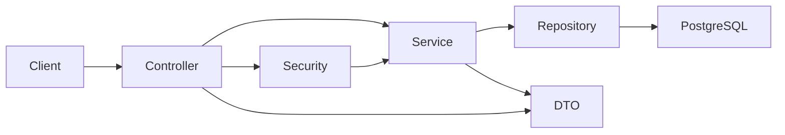

<!-- ==========project-documentation========== -->
# Product API (Zest India Assignment)

Backend API for product management with authentication, authorization, testing, and Docker support.

## Repository
- GitHub URL: `https://github.com/shubh100802/product-management-api.git`

## Overview
This project provides:
- Product CRUD endpoints (`/api/v1/products`)
- JWT login/register/refresh flow (`/api/v1/auth`)
- Role-based access (`ROLE_ADMIN`, `ROLE_USER`)
- Validation and centralized error handling
- Swagger/OpenAPI docs
- Unit and integration tests

## Tech Stack
- Java 17+
- Spring Boot 3
- Spring Data JPA (Hibernate)
- Spring Security + JWT
- PostgreSQL
- H2 (local/test profile)
- JUnit 5 + Mockito + Spring Boot Test
- Docker + Docker Compose

## High-Level Architecture


## Clone on a New Device
1. Install prerequisites:
- Git
- JDK 17+
- Maven 3.9+
- (Optional) Docker Desktop
- (Optional) PostgreSQL 14+

2. Clone the repository:
```bash
git clone https://github.com/shubh100802/product-management-api.git
cd product-management-api
```

3. Verify tools:
```bash
java -version
mvn -version
git --version
```

## Run Options

### Option A: Run Quickly (H2, no PostgreSQL required)
Use the local profile:
```bash
mvn spring-boot:run -Dspring-boot.run.profiles=local
```

App will start at:
- `http://localhost:8080`

### Option B: Run with PostgreSQL
1. Create database:
- DB name: `productdb`

2. Set environment variables.

PowerShell:
```powershell
$env:DB_URL="jdbc:postgresql://localhost:5432/productdb"
$env:DB_USERNAME="postgres"
$env:DB_PASSWORD="postgres"
$env:JWT_SECRET="replace-with-a-strong-secret-at-least-32-bytes"
$env:BOOTSTRAP_ADMIN_EMAIL="admin@zest.local"
$env:BOOTSTRAP_ADMIN_PASSWORD="ChangeMe@123"
$env:BOOTSTRAP_ADMIN_NAME="Assignment Admin"
```

Bash:
```bash
export DB_URL="jdbc:postgresql://localhost:5432/productdb"
export DB_USERNAME="postgres"
export DB_PASSWORD="postgres"
export JWT_SECRET="replace-with-a-strong-secret-at-least-32-bytes"
export BOOTSTRAP_ADMIN_EMAIL="admin@zest.local"
export BOOTSTRAP_ADMIN_PASSWORD="ChangeMe@123"
export BOOTSTRAP_ADMIN_NAME="Assignment Admin"
```

3. Start app:
```bash
mvn spring-boot:run
```

### Option C: Run via Docker (recommended for clean setup)
1. Create env file:

PowerShell:
```powershell
Copy-Item .env.example .env
```

Bash:
```bash
cp .env.example .env
```

2. Start containers:
```bash
docker compose up --build
```

3. Stop containers:
```bash
docker compose down
```

## Access URLs
- API base: `http://localhost:8080/api/v1`
- Swagger UI: `http://localhost:8080/swagger-ui.html`
- OpenAPI JSON: `http://localhost:8080/v3/api-docs`
- Health: `http://localhost:8080/actuator/health`

## Auth and Roles
- Public endpoints:
  - `POST /api/v1/auth/register`
  - `POST /api/v1/auth/login`
  - `POST /api/v1/auth/refresh`
- `ROLE_USER` and `ROLE_ADMIN`:
  - `GET /api/v1/products/**`
- `ROLE_ADMIN` only:
  - `POST|PUT|DELETE /api/v1/products/**`

## Main Endpoints
- `GET /api/v1/products`
- `GET /api/v1/products/{id}`
- `POST /api/v1/products`
- `PUT /api/v1/products/{id}`
- `DELETE /api/v1/products/{id}`
- `GET /api/v1/products/{id}/items`

## Tests
Run all tests:
```bash
mvn test
```

## Notes
- If someone clones directly from GitHub, they can run immediately using Option A (local/H2).
- For production-like usage, use PostgreSQL or Docker and set a strong `JWT_SECRET`.
- HTTPS enforcement can be enabled using `APP_SECURITY_REQUIRE_HTTPS=true`.

## Submission Checklist
- Public GitHub repository is accessible.
- `README.md` includes setup and run instructions.
- `Dockerfile` and `docker-compose.yml` are present.
- Swagger and health endpoints are reachable after startup.
- Tests pass using `mvn test`.
